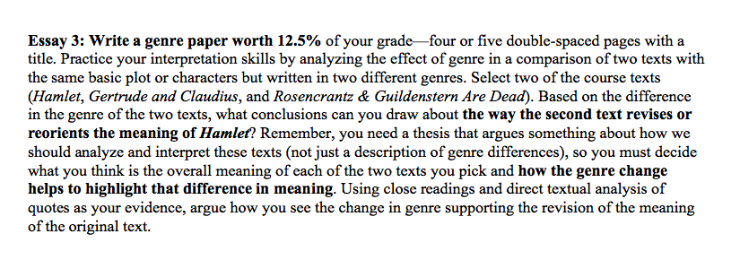
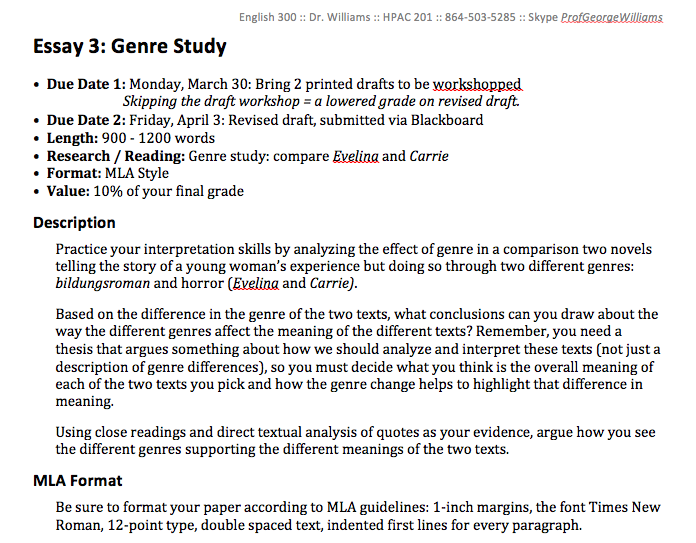

## Keeping Accessibility in Mind
### http://bit.ly/QEPFDIaccess

### George H. Williams / <a href="http://twitter.com/GeorgeOnline">@GeorgeOnline</a>

# Design

### Is "designer" in your  job title or description?
### Surprise! Everyone is always making design decisions.  <!-- .element: class="fragment" data-fragment-index="1" -->

# Design: example

## Course materials

<a href="20150410-emory-accessiblefuture-worddoc1.doc">MS Word document with a very basic design</a>.

<a href="20150410-emory-accessiblefuture-worddoc2.doc">MS Word document with more semantic design.

## "Accessible"

* Available  <!-- .element: class="fragment" data-fragment-index="1" -->
* Understandable <!-- .element: class="fragment" data-fragment-index="2" -->
* Usable  <!-- .element: class="fragment" data-fragment-index="3" -->
* Designed for people with disabilities  <!-- .element: class="fragment" data-fragment-index="4" -->

## Information + (Hardware + Software) + User

* How your information interacts with a user's technology will affect its accessibility.  <!-- .element: class="fragment" data-fragment-index="1" -->

## Design Philosophies

* Accessible Design  <!-- .element: class="fragment" data-fragment-index="1" -->
* Universal Design  <!-- .element: class="fragment" data-fragment-index="2" -->

Discussion: Advantages & Disadvantages?  <!-- .element: class="fragment" data-fragment-index="3" -->

## Workflow + Barriers: Discussion

What do you see as the barriers  to making your materials accessible?

## Solutions: Big Picture

<a href="http://www.udlcenter.org">National Center on Universal Design for Learning</a>

* "Founded in 2009, the National Universal Design Learning Center supports the effective implementation of UDL by connecting stakeholders in the field and providing resources and information." 

## Solutions: Framework

* "Accessibility is Good Design" by Alastair Somerville (<a href="http://twitter.com/acuity_design">@acuity_design</a>): http://ow.ly/N8eCg
* "All Technology is Assistive," by Sara Hendren (<a href="http://twitter.com/ablerism">@ablerism</a>) http://ow.ly/N8KcM

## Solutions: Nuts & Bolts

* "How to Create Accessible Documents," by George H. Williams: (<a href="http://twitter.com/georgeonline">@GeorgeOnline</a>): http://ow.ly/N8Le3
* "Cheatsheets" from the National Center on Disability and Access to Education (<a href="http://twitter.com/ncdae">@ncdae</a>): http://ow.ly/N8NZI

## Keeping Accessibility in Mind
### http://bit.ly/QEPFDIaccess

### George H. Williams / <a href="http://twitter.com/GeorgeOnline">@GeorgeOnline</a>