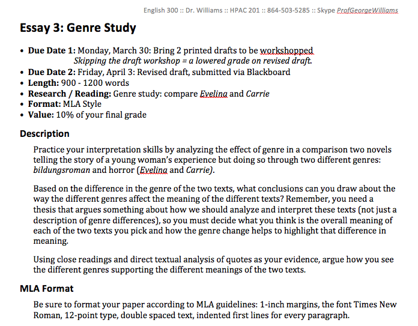

## Intro to Universal Design
### http://bit.ly/IntroUD

### George H. Williams / <a href="http://twitter.com/GeorgeOnline">@GeorgeOnline</a>

# Design

### Is "designer" in your  job title or description? <!-- .element: class="fragment" data-fragment-index="0" -->
### Surprise! Everyone is always making design decisions.  <!-- .element: class="fragment" data-fragment-index="1" -->

# Design: example

## Course materials

<a href="20150410-emory-accessiblefuture-worddoc1.doc">MS Word document with a very basic design</a>.

<a href="20150410-emory-accessiblefuture-worddoc2.doc">MS Word document with more semantic design.

## 
What is  Universal Design?

"A design concept that recognizes, respects, values and attempts to accommodate the broadest possible spectrum of human ability in the design of all products, environments and information systems" (<a href="https://www.ncsu.edu/project/design-projects/sites/cud/content/UD_intro.html">NCSU</a>).

## 
Universal Design  vs Accessible Design

Universal design is a *maximal* concept, aiming to provide the widest range of usability and access for the largest number of people.
  <!-- .element: class="fragment" data-fragment-index="1" -->

Accessible design, by contrast, involves only fulfilling the *minimum* requirements to meet regulatory standards.
  <!-- .element: class="fragment" data-fragment-index="2" -->

## 
What is Universal Design  for Learning?

"A framework to improve and optimize teaching and learning for all people" ([CAST](http://www.cast.org/our-work/about-udl.html#.V9wMvTusAqY)).
 <!-- .element: class="fragment" data-fragment-index="1" -->

## 
What about "accommodations"?

Advantage: meeting the needs of a particular student through communication with instructor.
  <!-- .element: class="fragment" data-fragment-index="1" -->

Disadvantage: sometimes implemented as a legalistic retrofit.
  <!-- .element: class="fragment" data-fragment-index="2" -->

## Design Philosophies

* Accessible Design  <!-- .element: class="fragment" data-fragment-index="1" -->
* Universal Design  <!-- .element: class="fragment" data-fragment-index="2" -->

## 5 specific tips for teachers

1. Speaking style in the classroom  <!-- .element: class="fragment" data-fragment-index="1" -->
2. Document design, both print and electronic  <!-- .element: class="fragment" data-fragment-index="2" -->
3. Creating (or selecting) videos with captions  <!-- .element: class="fragment" data-fragment-index="3" -->
4. Evaluating educational technology tools  <!-- .element: class="fragment" data-fragment-index="4" -->
5. Being open to change  <!-- .element: class="fragment" data-fragment-index="5" -->

## Solutions: Big Picture

<a href="http://www.udlcenter.org">National Center on Universal Design for Learning</a>

* "Founded in 2009, the National Universal Design Learning Center supports the effective implementation of UDL by connecting stakeholders in the field and providing resources and information." 

## Solutions: Big Picture

<a href="http://udloncampus.cast.org">UDL on Campus</a>

* A site devoted to universal design for learning in higher education.

## Solutions: Big Picture

<a href="https://accessiblesyllabus.tulane.edu">Accessible Syllabus</a>

* Advice on creating "accessible classroom resources [to] promote student engagement and agency."

## Solutions: Nuts & Bolts

"<a href="http://ncdae.org/resources/cheatsheets/">Cheatsheets</a>" from the National Center on Disability and Access to Education.

* "These one-page accessibility resources, or 'cheatsheets,' have been developed to assist anyone who is creating accessible content. These free resources are catered to less-technical individuals, such as faculty and staff."

## Solutions: Nuts & Bolts

<a href="http://webaim.org">WebAIM</a>: Web Accessibility in Mind

* "Our mission is to empower organizations to make their web content accessible to people with disabilities."

## Questions?
## Intro to Universal Design
### http://bit.ly/IntroUD

### George H. Williams / <a href="http://twitter.com/GeorgeOnline">@GeorgeOnline</a>