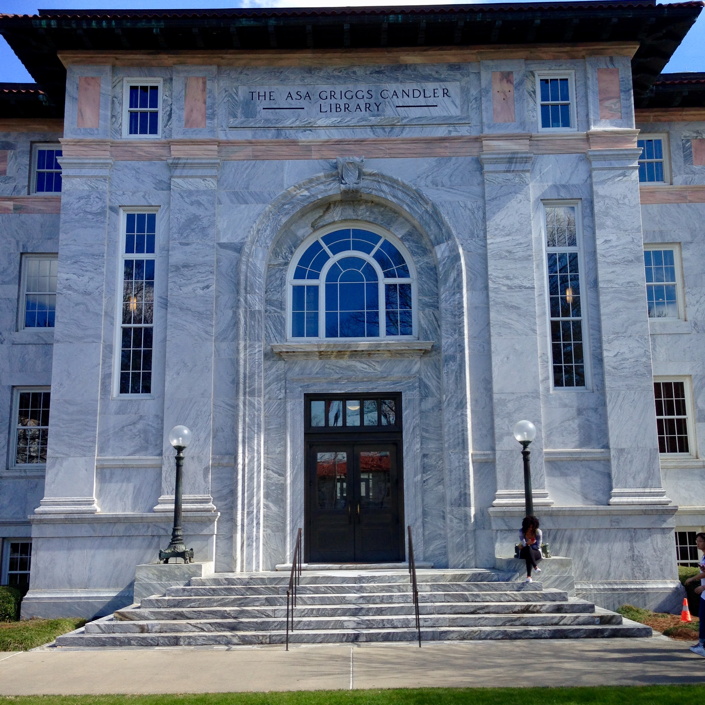
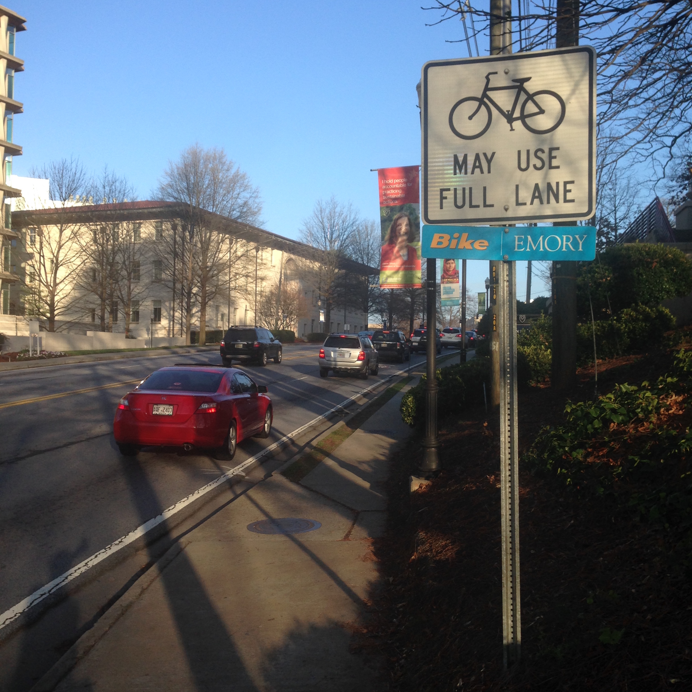
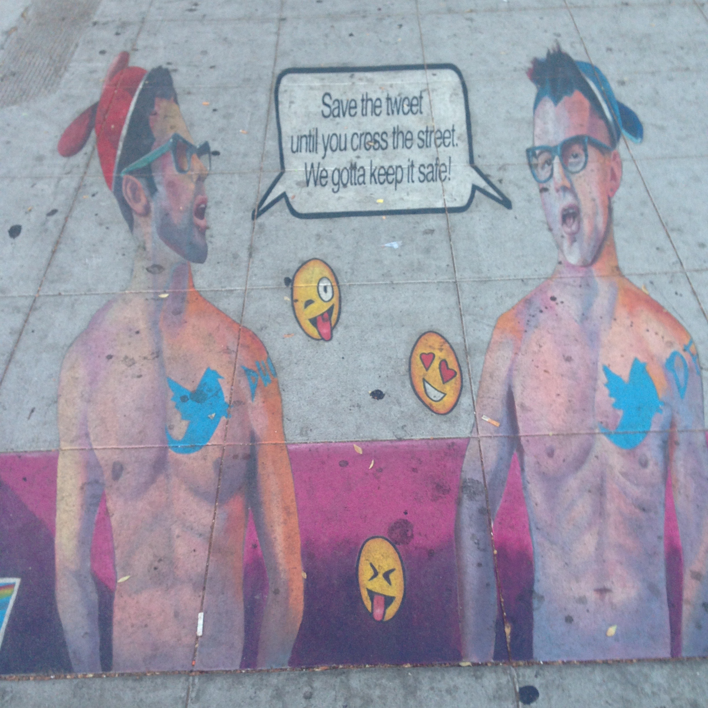
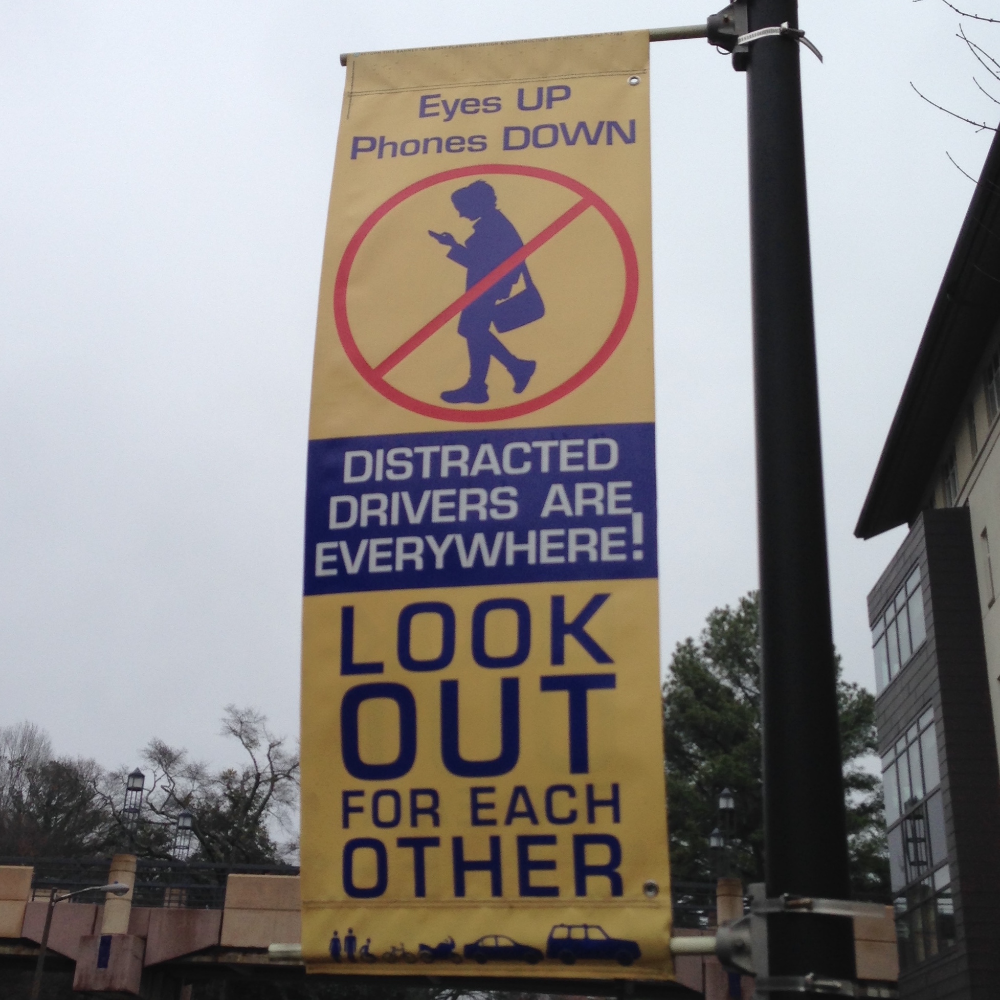

## Intro to Universal Design
### http://bit.ly/IntroUD

### George H. Williams / <a href="http://twitter.com/GeorgeOnline">@GeorgeOnline</a>

# Design

### Is "designer" in your  job title or description? <!-- .element: class="fragment" data-fragment-index="0" -->
### Surprise! Everyone is always making design decisions.  <!-- .element: class="fragment" data-fragment-index="1" -->

# Design: example

## Course materials

<a href="20150410-emory-accessiblefuture-worddoc1.doc">MS Word document with a very basic design</a>.

<a href="20150410-emory-accessiblefuture-worddoc2.docx">MS Word document with more semantic design.

### Steep Steps

## 
What is  Universal Design?

"A design concept that recognizes, respects, values and attempts to accommodate the broadest possible spectrum of human ability in the design of all products, environments and information systems" (<a href="https://www.ncsu.edu/project/design-projects/sites/cud/content/UD_intro.html">NCSU</a>).

## 
Universal Design  vs Accessible Design

Universal design is a *maximal* concept, aiming to provide the widest range of usability and access for the largest number of people.
  <!-- .element: class="fragment" data-fragment-index="1" -->

Accessible design, by contrast, involves only fulfilling the *minimum* requirements to meet regulatory standards.
  <!-- .element: class="fragment" data-fragment-index="2" -->

## 
What about "accommodations"?

Advantage: meeting the needs of a particular student through communication with instructor.
  <!-- .element: class="fragment" data-fragment-index="1" -->

Disadvantage: sometimes implemented as a legalistic retrofit.
  <!-- .element: class="fragment" data-fragment-index="2" -->

### Classic Universal Design Example...
###   <!-- .element: class="fragment" data-fragment-index="1" -->

### Mixed Messages

### 
"Defeat Device"

"We've created what you asked us to create, even if it doesn't do what it's supposed to do. It <em>does</em> pass the test that you've created, though."

### 
An Expanding Universe

Things change

* Diagnostics methods
* Behaviors
* Expectations
* Technology

### Changing Behavior

### Student Behavior

## Questions?
## Intro to Universal Design
### http://bit.ly/IntroUD

### George H. Williams / <a href="http://twitter.com/GeorgeOnline">@GeorgeOnline</a>