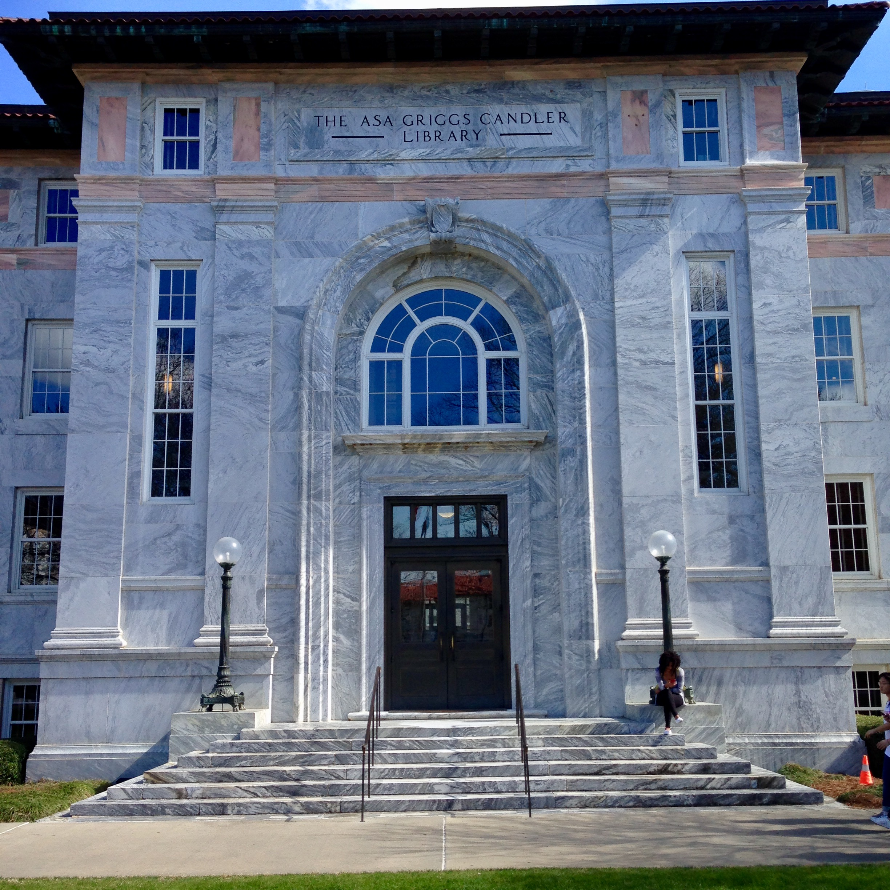
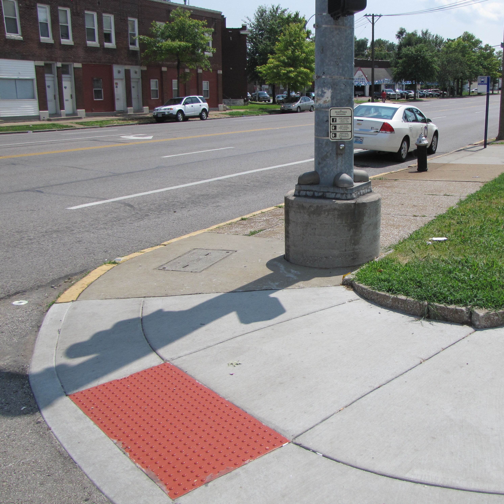
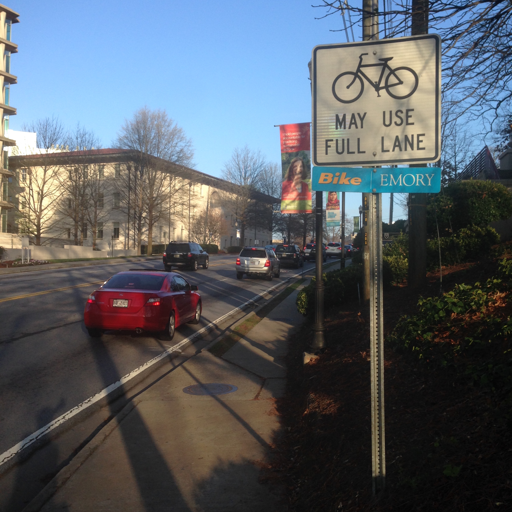
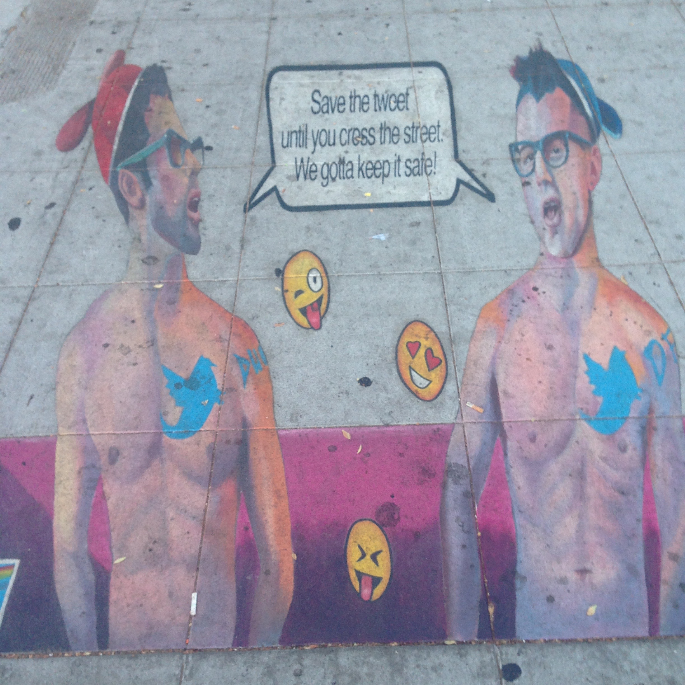
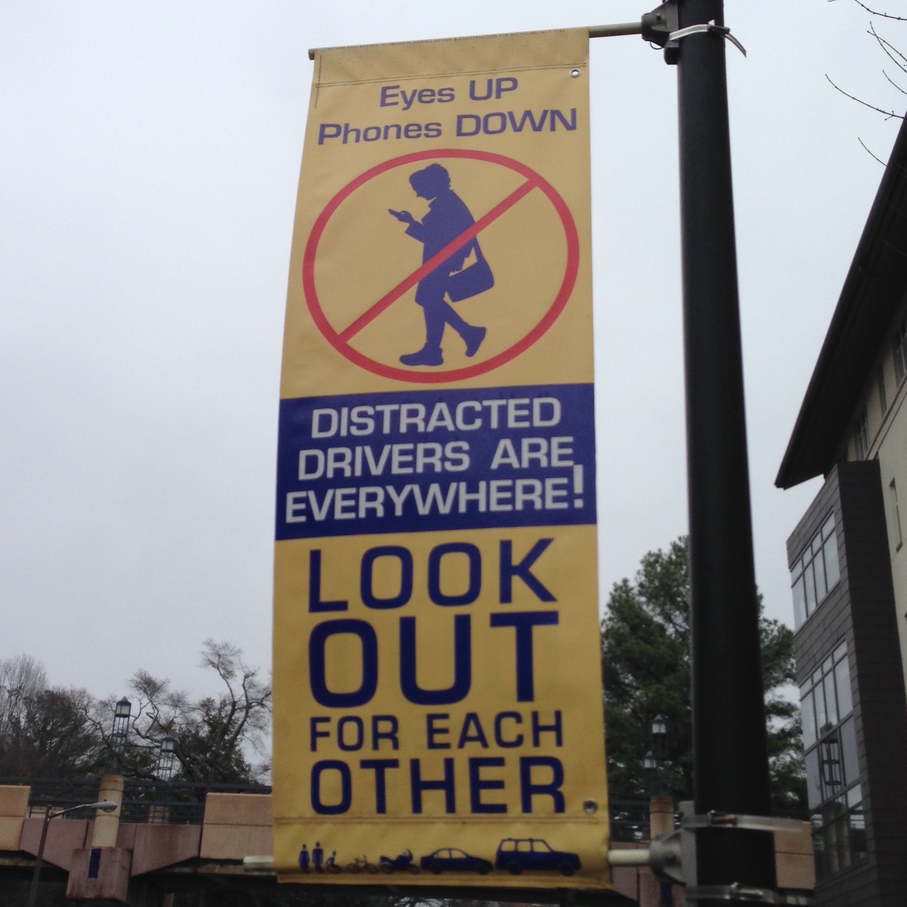

## Re-Thinking Universal Design for Learning

### George H. Williams / <a href="http://twitter.com/GeorgeOnline">@GeorgeOnline</a>

### Steep Steps

## 
What is  Universal Design?

"A design concept that recognizes, respects, values and attempts to accommodate the broadest possible spectrum of human ability in the design of all products, environments and information systems" (<a href="https://www.ncsu.edu/project/design-projects/sites/cud/content/UD_intro.html">NCSU</a>).

## 
Universal Design  vs Accessible Design

Universal design is a *maximal* concept, aiming to provide the widest range of usability and access for the largest number of people.
  <!-- .element: class="fragment" data-fragment-index="1" -->

Accessible design, by contrast, involves only fulfilling the *minimum* requirements to meet regulatory standards.
  <!-- .element: class="fragment" data-fragment-index="2" -->

## 
What is Universal Design  for Learning?

"A framework to improve and optimize teaching and learning for all people" ([CAST](http://www.cast.org/our-work/about-udl.html#.V9wMvTusAqY)).
 <!-- .element: class="fragment" data-fragment-index="1" -->

## 
What about "accommodations"?

Advantage: meeting the needs of a particular student through communication with instructor.
  <!-- .element: class="fragment" data-fragment-index="1" -->

Disadvantage: sometimes implemented as a legalistic retrofit.
  <!-- .element: class="fragment" data-fragment-index="2" -->

### Classic Universal Design Example...
###   <!-- .element: class="fragment" data-fragment-index="1" -->

### Mixed Messages

### 
"Defeat Device"

"We've created what you asked us to create, even if it doesn't do what it's supposed to do. It <em>does</em> pass the test that you've created, though."

### 
An Expanding Universe

Things change

* Diagnostics methods
* Behaviors
* Expectations
* Technology

### Changing Behavior

### Student Behavior

## Re-Thinking Universal Design for Learning

### George H. Williams / <a href="http://twitter.com/GeorgeOnline">@GeorgeOnline</a>me